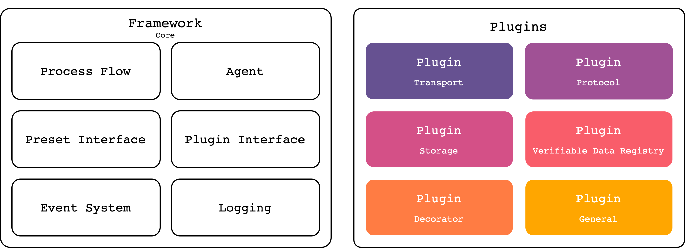
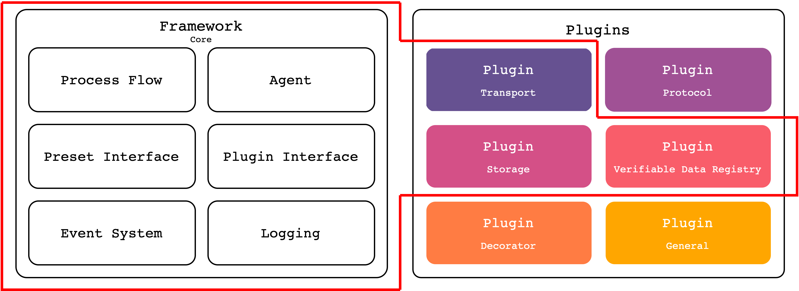

# About

The Easy SSI project aims to make the setup of self-sovereign identity solutions and the integration of self-sovereign identity functionality into any project _as easy as possible_.

We do this by creating an ecosystem of plugins and presets using [Hyperledger Aries Framework Javascript](https://github.com/hyperledger/aries-framework-javascript). In order to increase the adoption of self-sovereign identity we are making it easy for developers to use existing technologies and connect to ssi projects already out there. Allowing _every_ developer to integrate ssi into their project without hassle.

Components are proposed and worked on by the community. Currently we are working on both [plugins](./plugins/README.md) and [presets](./presets/README.md). To get involved or make a proposal please read [How to Contribute](./how-to-contribute.md).

 

### Plugins

During the Easy SSI project the core of [Hyperledger Aries Framework Javascript](https://github.com/hyperledger/aries-framework-javascript) will be extended with plugins to add specific functionality. Plugins can be connected and/or interchanged while different types of plugins can add different types of functionality. The state of specific plugins as well as the discussion surrounding them is documented in the [plugins](plugins/README.md) folder.

Plugins are additions to the AFJ core framework that implement specific functionality.

### Presets

Presets allow developers to easily setup a type of agent/service with default values to keep or customise. A preset is a configuration of the core framwork with a choice of plugins that suit the use case already enabled. Presets can be used out of the box, or function as a starting points for developers. The state of specific presets as well as the discussion surrounding them is documented in the [presets](presets/README.md) folder.

A preset is a configuration of the framework with preselected plugins.

## Roadmap

The Easy SSI project is currently working towards a refactor of AFJ and creating a priority order for implementing the first presets and plugins. 

- [x] Move project to public repo
- [x] Schedule community call
- [x] Involve AFJ community
- [x] Work out list of pre-proposals
- [x] Contact plugin collaborators
- [x] API design
- [x] Refactor design AFJ
- [x] Funding proposal
- [x] AFJ usable in React Native
- [x] Demo chat agent
- [x] Demo mobile holder agent
- [ ] Aries interop profile 2.0
- [ ] Future proof design (beyond Indy)
- [ ] Refactor AFJ
- [ ] Mobile Agent Preset
- [ ] Implement first plugins

### Pre-proposed

The project started internally and grew to a public space. Beneath is the current list of 'pre-proposed' ideas we'd like to iterate on to create well thought out proposals. 

Transport plugins
- HTTP
- Websocket
- Bluetooth
- NFC

Protocol-as-plugin
- Issue credential 2.0
- Present proof 2.0
- Mediator coordination 1.0
- Pickup 1.0
- DID exchange 1.0

Decorator plugins
- Attachement
- Thread
- Transport

General plugins
- eIDAS Bridge
- SSI Single sign on
- Wordpress
- Identity HUb
- Universal DID resolver

Other plugins
- Acknowledgement
- Problem report
- REST API extenstions

Presets
- Mobile agent preset
- Organisational agent preset
- Developer presets

Also we'd like to explore the option to add example projects based on a specific use case. 

## Contribute

Do you have a great idea or question? To get involved or learn more check-out [How to Contribute](how-to-contribute.md)!
